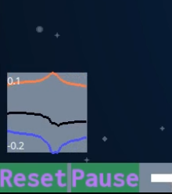
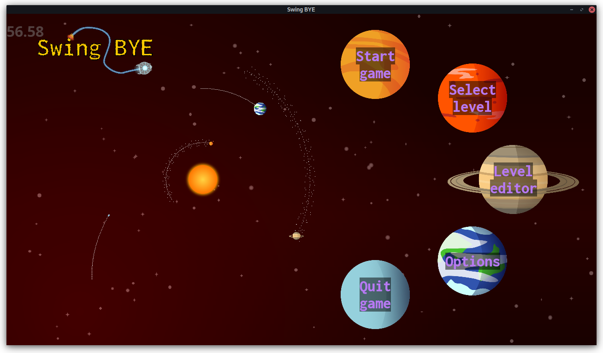
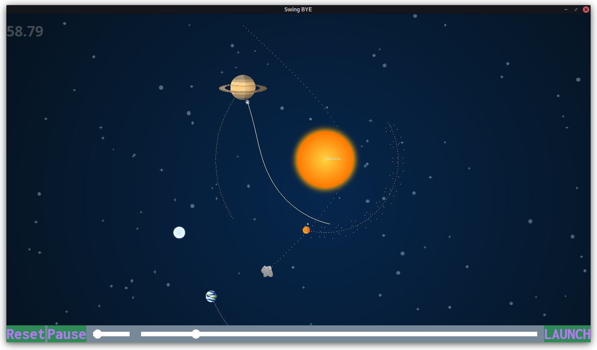
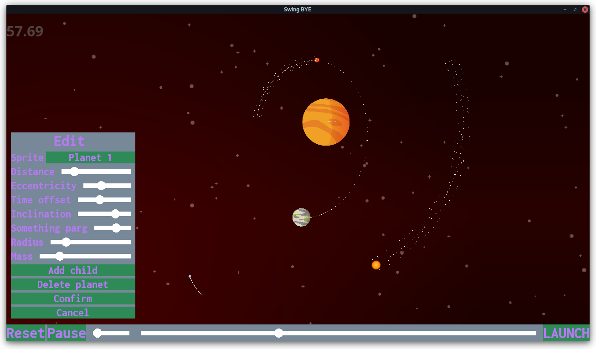
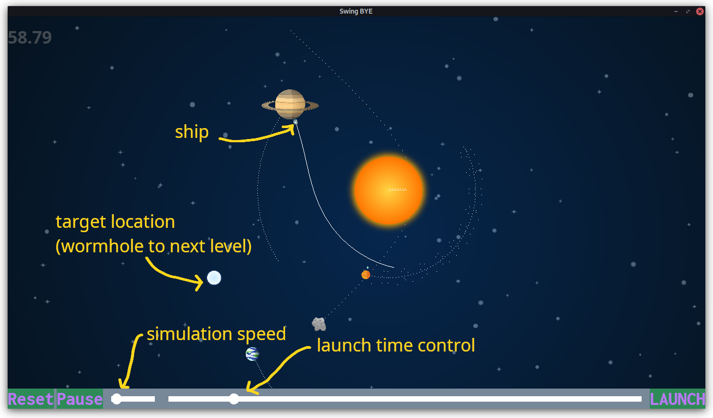

# Swing-bye-py

Swing-bye is a game about learning to use swing-by manoeuvres to get to a target, that would otherwise be impossible to reach.

The state of the project is still a work in progress, with only the core gameplay mechanics and UI implemented.

To help the player, a little graph at the bottom left of the screen shows the evolution of the ship's energy :
- Orange line : kinetic energy T
- Blue line : potential energy U
- Black line : total energy E = T + U

If the swing-bye manoeuvre is performed correctly, the player will see an uptick in the total energy of the ship.

## Screenshots and demo videos

[Gameplay demo video ](media/swingbye_demo_gameplay.mp4)

[Editor demo video ](media/swingbye_demo_editor.mp4)

## Controls

Press `0` to focus on the target, `1` to focus on the ship, any other number key to lose focus.

Pan and scroll with mouse to control camera position and zoom.

Use the time slider to adjust launch date, and once launched, the speed of the game can also be changed.

## Simulation notes

The physics engine is written in C++, and compiled to a Python module using `pybind11`.

Planet positions are computed by numerically solving Euler's equation (see [planet.hpp](swingbye/cphysics/src/planet.hpp)). This allows to explicitly adapting the orbit paramters (eccentricity, major axis, inclination, etc.), and being able to exactly compute the positions at any time.

After launch, the ship is simulated by solving Newton's second law numerically, using a Runge-Kutta integrator of order 4 (see [integrator.hpp](swingbye/cphysics/src/integrator.hpp))

## How to compile and run

1. Install the Python dependencies : `pip install -r requirements.txt`
2. Compile the `cphysics` submodule : `make build-cphysics`. This required having the `smart_holder` branch of `pybind11`, which can be installed by running `make install-pybind-smart_holder`
3. Run the game : `python -m swingbye`

## TODO

Rendering

- [X] Fix background parallax on resize
- [X] Create Background class to hold all stars and background image
- [ ] Give each level a seed to keep the background consistant
- [X] Fix weird glitch with hiding / unhiding Graph (becomes blocky for some reason?)
- [ ] Planet / comet labels
- [X] Texture comets
- [X] FIX THE GODDAMN CAMERA (Y A T T A)
- [X] KE and PE graphs
- [ ] Find out why button text sometimes appears bellow the button

Code structure and stuff

- [ ] Correctly dispose of useless sprites / paths
- [ ] Combine WorldState and GameState

UI

- [ ] Make it not ugly
- [ ] Custom main menu w/ animations?
- [ ] Make options actually do something
- [ ] Make level selection work

Physics

- [X] Ship prediction
- [X] Orbit lines
- [X] KE and PE
- [X] optimize physics in c++

Game

- [ ] State management (reset, next level, etc)
- [ ] Make more levels
- [ ] Animations on level entry (e.g. zoom in, time autoscroll, cutscene????)
- [ ] Add the goal (black hole?) to the levels
- [ ] Integrate easter eggs
- [ ] Make ship hitbox smaller than sprite
- [X] Make functional level editor
- [X] Allow for exporting worlds from the editor
- [ ] Allow to add ship in editor

Structure

- [ ] use git submodules for the pybind11-smart_holder dependency
